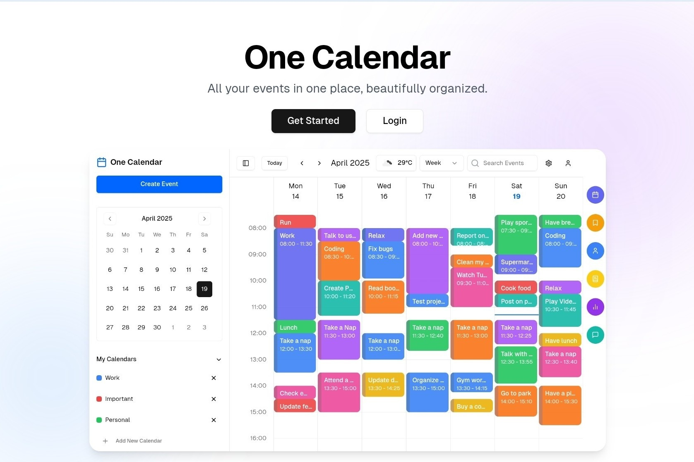

<div align="center">
  

# One Calendar

<p>

<a href="https://vercel.com/tech-art/one-calendar" target="_blank"></a>
<a href="https://github.com/EvanTechDev/One-Calendar/blob/master/LICENSE" target="blank"></a>
<a href="https://github.com/EvanTechDev/One-Calendar/fork" target="blank"></a>
<a href="https://github.com/EvanTechDev/One-Calendar/stargazers" target="blank"></a>
<a href="https://github.com/EvanTechDev/One-Calendar/issues" target="blank"></a>
<a href="https://github.com/EvanTechDev/One-Calendar/pulls" target="blank"></a>

</p>

A beautifully minimal open-source calendar app to plan your week and life.

<a href="https://vercel.com/new/clone?repository-url=https://github.com/Dev-Huang1/One-Calendar&env=NEXT_PUBLIC_BASE_URL,NEXT_PUBLIC_CLERK_PUBLISHABLE_KEY,CLERK_SECRET_KEY,OPENWEATHER_API_KEY,BLOB_READ_WRITE_TOKEN&project-name=one-calendar&repo-name=one-calendar" style="display: inline-block;">
  
</a>

<a href="https://app.netlify.com/start/deploy?repository=https://github.com/Dev-Huang1/One-Calendar" style="display: inline-block;">
  
</a>

<a href="https://railway.app/new/template?template=https://github.com/Dev-Huang1/One-Calendar&envs=NEXT_PUBLIC_BASE_URL,NEXT_PUBLIC_CLERK_PUBLISHABLE_KEY,CLERK_SECRET_KEY,OPENWEATHER_API_KEY,BLOB_READ_WRITE_TOKEN&optionalEnvs=NEXT_PUBLIC_BASE_URL,NEXT_PUBLIC_CLERK_PUBLISHABLE_KEY,CLERK_SECRET_KEY,OPENWEATHER_API_KEY,BLOB_READ_WRITE_TOKEN&projectName=one-calendar" style="display: inline-block;">
  
</a>

</div>

## What is One Calendar?

**One Calendar** is a privacy-first, weekly-focused, open-source calendar app, designed to help individuals and teams plan, focus, and stay in sync.

> Without *One Calendar*, your schedule is scattered. With it, your week feels intentional.

## Why One Calendar?

Most calendar tools are cluttered, over-engineered, or locked behind paywalls. One Calendar aims to be:

- 🧠 **Simple and Intuitive** – Weekly view first, with minimal distractions.
- 🕹 **Interactive & Smooth** – Drag, drop, right-click, and edit with ease.
- 🔐 **Private & Local** – Your data is yours. Export, backup, and control.
- ☁️ **Cloud Sync** – Optional sync via Vercel Blob.
- 🌐 **Clerk-Account** – Easily login with third-party.
- 🌍 **International** – Automatically adapts to your language (English / 中文).
- 🧱 **Customizable** – Tailor themes, default view, and integrations.

## Tech Stack

- **Frontend**: Next.js 14, Tailwind CSS, shadcn/ui, TypeScript
- **Auth**: Clerk
- **Storage**: LocalStorage, Vercel Blob
- **Weather**: OpenWeather API


## Preview




## Getting Started

### Prerequisites

Required Versions:

- [NodeJS](https://nodejs.org) (v18 or higher)
- [Bun](https://bun.sh) (v1.2 or higher)

### Quick Start

```bash
# Clone the repo
git clone https://github.com/Dev-Huang1/One-Calendar.git
cd One-Calendar

# Install dependencies
bun install

# Start the app
bun run dev
```

Then visit `http://localhost:3000`

### Environment Variables

Copy `.env.example` to `.env` and fill in:

```env
NEXT_PUBLIC_BASE_URL=your-url

# Clerk API key
NEXT_PUBLIC_CLERK_PUBLISHABLE_KEY=your-clerk-publishable-key
CLERK_SECRET_KEY=your-clerk-secret

# Weather API
OPENWEATHER_API_KEY=your-open-weather-api-key

# Vercel blob token
BLOB_READ_WRITE_TOKEN=your-vercel-blob-token
```

## Roadmap

You can report a bug or request a new feature on our feedback website

[Roadmap & Feedback](https://feedback.xyehr.cn)

## Star History

[](https://www.star-history.com/#Dev-Huang1/One-Calendar&Date)

## The Team

Brought to you by a small team of makers who love clean tools and open-source.

Check out our [contributors](https://github.com/Dev-Huang1/One-Calendar/graphs/contributors) ❤️

## Acknowledgements

This project wouldn't be possible without these awesome services:

<div style="display: flex; justify-content: center;">
  <a href="https://vercel.com" style="text-decoration: none;">
    
  </a>
  <a href="https://clerk.com" style="text-decoration: none;">
    
  </a>
  <a href="https://openweathermap.org" style="text-decoration: none;">
    
  </a>
</div>

## License

[GPL 3.0 Licensed](./LICENSE). Copyright © One Calendar 2025.
